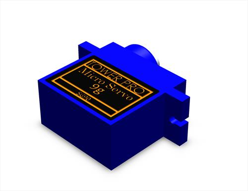
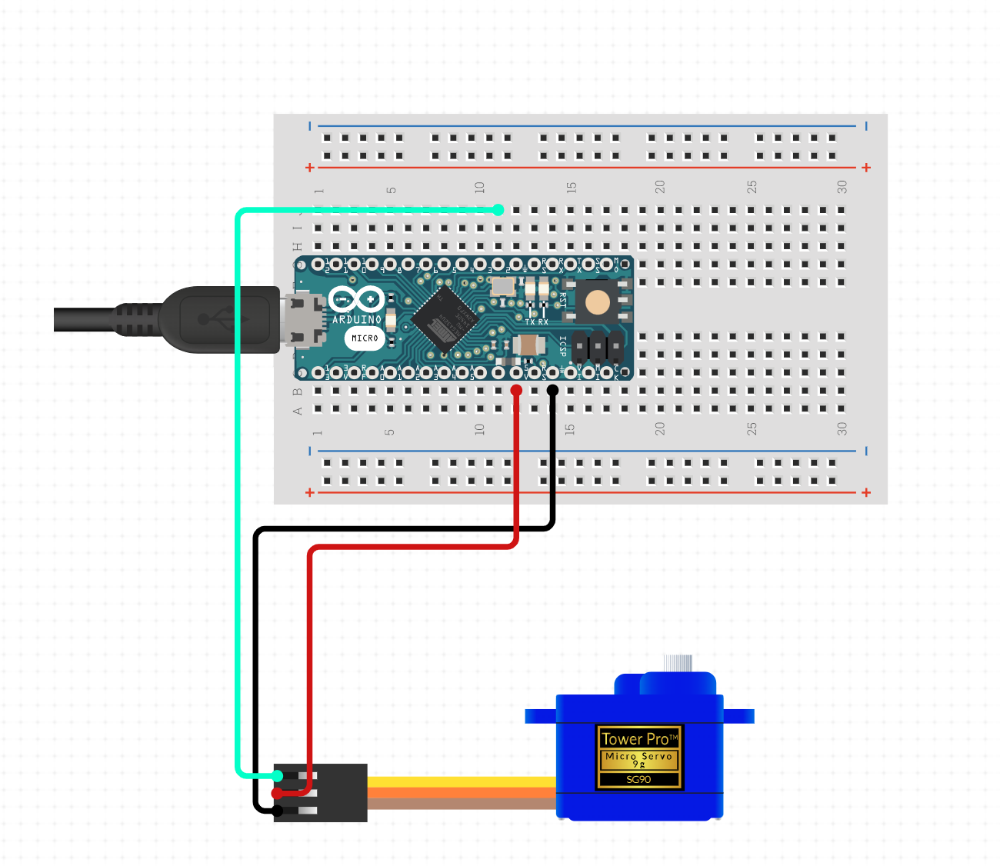
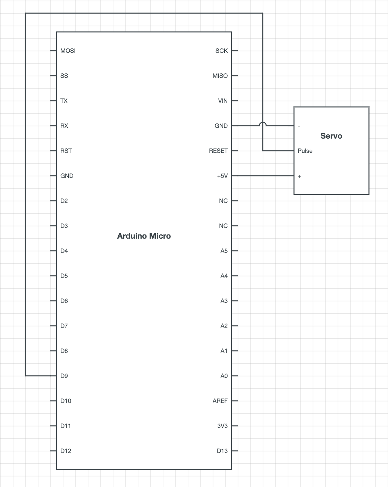
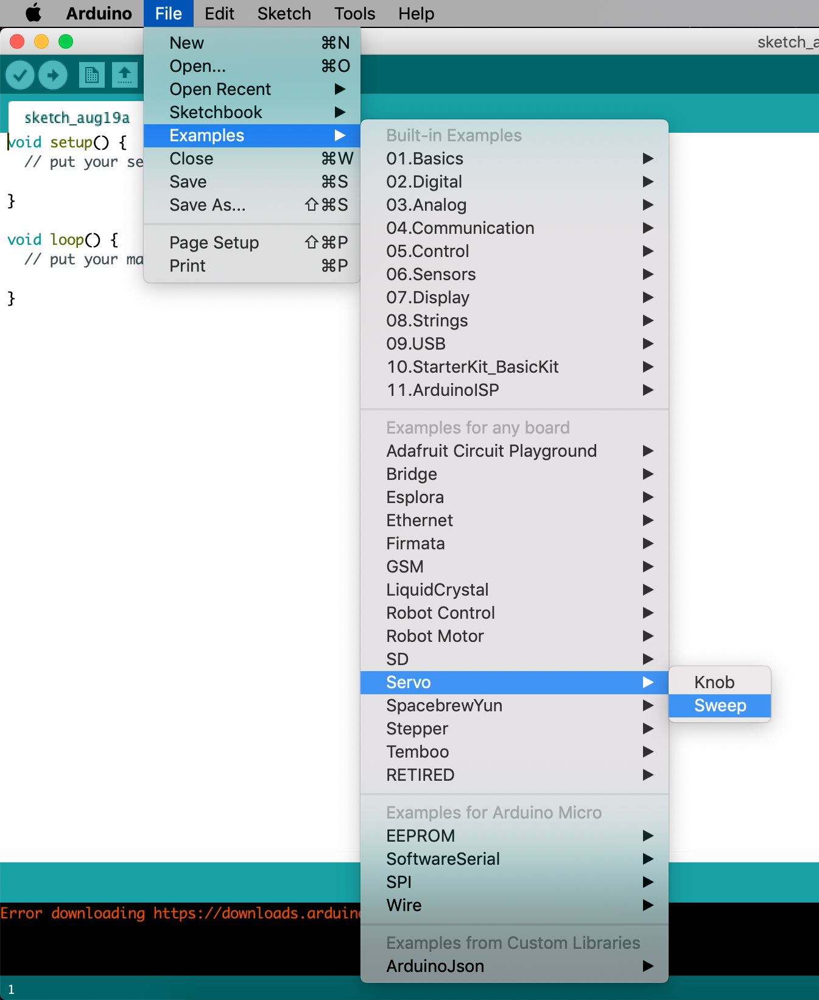

## Servo Tutorial 


#### Introduction
This tutorial demonstrates how to operate an Arduino Micro board to power and control a standard servo, with the use of the *Sweep* example found in the [Servo library](https://www.arduino.cc/reference/en/libraries/servo/). The goal is to use the Arduino Micro board to send the motor a position value in degrees over pulse width modulation (PWM) that will rotate the servo back and forth in approximately 180 degrees.

#### List of Materials
* Arduino Micro board **x 1**
* Micro servo SG90 **x 1**
* Generic jumper wires **x 3**
* Breadboard **x 1**


#### About Servo Motors
The servo motor is controlled with an electric signal either analog or digital which determines the amount of movement that represents the final command position for the shaft. Standard servo motors have an external shaft that rotates a narrow range and can be precisely moved to various controlled positions/angles when receiving a coded signal, in this case through the Arduino Micro board. Compared to a continuous servo that rotates 360 degrees and offers an open loop speed control, a standard geared servo motor can create all sorts of periodic or alternate motions with a precisely controlled position. The servo motor used in this tutorial is a standard geared SG90.


<div style="text-align:center">

</div>


#### Circuit  

Servo motors have three wires. The red is power (VCC usually requiring 4.8V to 7.2V), brown is ground, and yellow is control signal (PWM). As a good practice, the power wire is typically red, and should be connected to the 5V pin on the Arduino board. The ground wire is typically black or brown and should be connected to a ground pin (GND) on the board. Lastly, the signal pin is typically yellow, orange or white and should be connected to pin 9 on the board.

<div style="text-align:center">

</div>

 
#### Schematic

<div style="text-align:center">

</div>


#### Sweep Example 


**1**. On Arduino IDE the *Sweep* example can be found under *File >  Examples > Servo > Sweep*.
**2**. With the Arduino board connected, upload the sketch to the board.
**3**. Now the servo will start moving from 0 to almost 180 degrees, moving back and forth. 

<div style="text-align:center">

</div>


#### Code

At the top of the code, `#include <Servo.h>` allows the use of the servo library. Declare the `Servo` which is a type of object from the library, and set the variable to store the initial position of the servo's angle `int pos = 0;`

The `setup()` function is called when a sketch starts. The number of pin is set with the function `.attach()` following the pin number in the parenthesis, in this case the library supports pins 9 and 10.

Inside the `loop()` function which runs constantly there are two `for` loops including some arguments that will run through the block of code until a test condition is complete. The three arguments on the first `for` loop indicate:
  -  The initial value of `pos = 0;` triggers the for loop. 
   -  The second argument checks if pos is less than or equal to 180 and loops through until its false.
   -  The third argument increments the pos variable up by one.

Then the new position variable is set with the function `.write()` and a delay of 15ms is added allowing the servo to reach its position. The loop code block will run until the servo reaches approximately 180 degrees and the conditions are no longer true.

```C
for (pos = 0; pos <= 180; pos += 1) {
myservo.write(pos);
delay(15);
}
```

 Next, the second for loop code will run opposite from the first one, starting at 180 degrees and moving towards 0.  


#### Learning Outcome

Through this tutorial a basic knowledge of what a servo motor is, how to connect them with an Arduino Micro board and utilise them in order to create simple motions has been achieved. Servos can be used in various projects involving various motions from smart gadgets, mechanical parts and even upgraded domestic appliances, where a little imagination goes a long way. Happy experimenting!


[//]: # "Regarding the images: In the case where I would like to achieve maximum compatibility I would resize the image and avoid centering it by using basic image markdown syntax"


